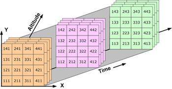
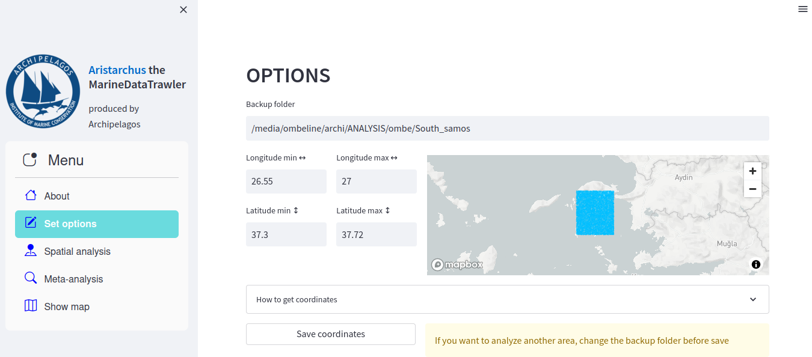
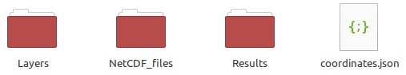

What can I do with Aristarchus the MarineDataTrawler ?
======================================================

The purpose of Aristarchus the MarineDataTrawler is to make spatial analysis easier, using marine environmental variables 
from  `Copernicus <https://data.marine.copernicus.eu/products>`_ database, such as 🌡️ sea surface temperature,
🧂 salinity, 💚 plankton...

You will need to create a `copernicus account <https://data.marine.copernicus.eu/register>`_ in order to download satellite data in NetCDF files.

What is a NetCDF file?
----------------------
NetCDF (Network Common Data Form) is a file format for storing multidimensional scientific data.
For each longitude, latitude and date, you will have a corresponding data. In **Spatial analysis** 
you can first create a NetCDF file for 1 year at a specific area.

To change the desired coordinates, update it in **Set options**.

What will be created in the backup folder?
------------------------------------------
You can set the backup folder in **Set options**

3 folders will be created:
    - **NetCDF_files** : *.nc files*, 1 file = 1 variable at 1 year at delimited depths if required
    - **Layers** : *.tif files*, for statistics on each pixel
    - **Results** : 
        - *__MW.txt* are used to save moving window analysis, 
        - *__CORR.csv* are used to save correlation between species presence and variables data

Each of these folders are divided in subfolders created automatically, each name correspond to 
the name of the copernicus service providing the dataset(s). During NetCDF file creation you will 
be asked to define prefix for datasets sharing same service and variable.
    

Spatial analysis
----------------
In order to analyse an environmental variable you must first create a NetCDF file for this variable.

You can either:
    - analyse the average of a variable over the whole area within 1 year (moving window)
    - compute statistics (avg,std,min-max) of a variable for each pixel using QGIS software
    - correlate occurrence data (coordinates/date) with the correspondent variable within 1 year. To do this you will need to upload a csv containing the presence data in **Spatial analysis**
    

Meta-analysis
-------------
This page is used to:

- show general trend of a variable with all the MW analysis created for 1 dataset, it will compute also a 12-months MW (can take few seconds) of all data. Several tests are performed
    
    - Linear regression 
    - Mann-Kendall Trend Test
    - Seasonal-Trend decomposition using LOESS

- plot occurrences correlated on MW